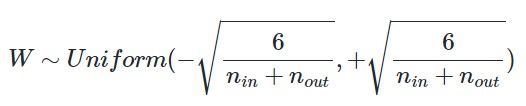
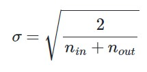
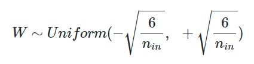
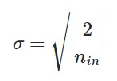
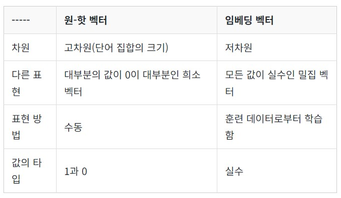
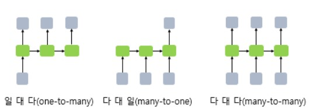
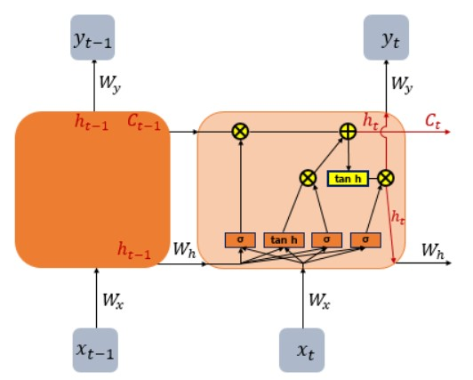
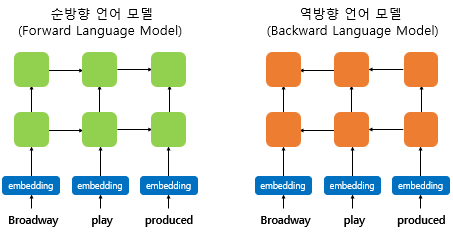

## Deep Learning
- Artifical Neural Network(인공 신경망)의 층을 연속적으로 쌓아올려 데이터를 학습
- 기계가 가중치를 스스로 찾아내도록 자동화 시키는 심층 신경망의 학습

### Perceptron(퍼셉트론)
- 초기 형태의 인공 신경망
- 입력값 x 벡터에 대해 가중치 w를 곱하고 편향 b(-임계값)을 더해 결과값 y를 도출

### Single-Layer Perceptron
- Input layer(입력층)과 Output layer(출력층)으로 구성
### Multi-Layer Perceptron
- Input, Output layer 사이에 Hidden layer(은닉층)을 두어 좀 더 복잡한 문제에 대응
    * Feed-Forward Neural Network(FFNN) : 입력층에서 출력층방향으로 연산이 전개
    * RNN : 은닉층의 출력값을 출력층과 은닉층의 입력으로 사용
    * Fully-connected Layer : 어떤 층의 모든 뉴런이 이전 층의 모든 뉴런과 연결된 층
    * Activation Function(활성화 함수) : 은닉층과 출력층의 뉴런에서 출력값을 결정하는 비선형 함수
        + Step Function(계단 함수)
        + Sigmoid Function : 시그모이드 함수를 활성화 함수로 하는 인공 신경망을 다층으로 쌓을 때 역전파 과정에서 사용하는 경사 하강법에 의해 Vanishing Gradient(기울기 소실)이 발생하여 학습이 잘 이루어지지 않음
        + Hyperbolic tangent function
        + ReLU Function : 음수 입력에 대해 0을 출력하고, 양수는 입력값을 출력
        + Leaky ReLU
        + Softmax Function : 시그모이드 함수처럼 출력층에서 주로 사용되며, 시그모이드가 이진 분류에 사용되는 반면, 소프트맥스는 다중 클래스 분류에 주로 사용

### Forward Propagation(순전파)
- 입력층에서 출력층 방향으로 연산을 진행하는 과정
### BackPropagation(역전파)
- 순전파 과정을 진행하여 예측값과 실제값의 오차를 계산하였을 때, 경사 하강법을 사용하여 학습률을 반영해 가중치를 업데이트하는 과정
### Concept
- Loss function : 실제값과 예측값의 차이를 수치화 해주는 함수
    * MSE
    * Binary Cross-Entropy
    * Categorical Cross-Entropy
- Batch : 가중치 등의 매개 변수의 값을 조정하기 위해 사용하는 데이터의 양
    * Batch Gradient Descent : Optimizer 중 하나로 오차를 구할 때 전체 데이터를 고려
    * Stochastic GD : 랜덤으로 선택한 하나의 데이터에 대해서만 경사 하강법을 계산
    * Mini-Batch GD : 적당한 수의 배치 크기를 지정하여 GD를 실행
- Optimizer : Compile 과정에서 사용
    * Momentum : GD에서 계산된 접선의 기울기에 한 시점 전의 접선의 기울기 값을 일정한 비율만큼 반영
    * Adagrad : 각각의 매개변수에 서로 다른 학습률을 적용
    * RMSprop : Adagrad의 학습률이 지나치게 떨어지는 단점을 보완하기 위해 사용
    * Adam : RMSprop과 Momentum을 합친 방식
- Epoch : 인공 신경망에서 전체 데이터에 대해서 순전파와 역전파가 끝난 상태로 훈련 및 검증 과정이 한차례 끝난 것
- Gradient Vanishing : 역전파 과정에서 입력층으로 갈 수록 기울기가 점차적으로 작아져 입력층에 가까운 층들에서의 업데이트가 제대로 이루어지지 않는 상태
- Gradient Exploding : 기울기가 점차 커져서 가중치들의 값이 발산
    * Gradient Clipping : 기울기 폭주를 막기 위해 임계값을 넘지 않도록 값을 제한
    * Weight initialization
        + Xavier Initialization : 이전 층과 다음 층의 뉴런의 개수를 고려하여, 여러 층의 기울기 분산 사이에 균형을 맞춰서 특정 층이 너무 주목을 받거나 다른 층이 뒤쳐지는 것을 방지(S자 형태의 activation function에서 좋은 성능)  
        + He Initialization : 이전 층의 뉴런의 개수를 반영하여 초기화(ReLU 계열 함수에 효율적)  
    * Batch Normalization(배치 정규화) : 인공 신경망에 들어가는 각 입력을 평균과 분산으로 정규화
        + Internal Covariate Shift(내부 공변량 변화) : 학습에 의해 가중치가 변화하면, 입력 시점에 따라 입력 데이터의 분포가 변화하는 것
    * Layer Normalization(층 정규화)

### 과적합을 방지하는 방법
1. 데이터의 양을 늘리기 : 데이터의 양이 적을 때, 데이터의 특정 패턴이나 노이즈까지 쉽게 암기할 수 있으므로, 데이터의 양을 늘려 일반적인 패턴을 학습(ex - Data Augmentation, Back Translation)

2. 모델의 복잡도 줄이기 : 은닉층의 수, 매개변수의 수를 줄여서 사용

3. Regularization(가중치 규제) 적용하기
    - L1 regularization : 가중치 w들의 절댓값의 합을 비용함수에 추가
    - L2 regularization : 모든 가중치 w들의 제곱합을 비용함수에 추가
4. Dropout : 학습 과정에서 설정한 비율로 랜덤한 신경망을 사용하지 않는 방법으로, 특정 뉴런 또는 특정 조합에 너무 의존적으로 되는 것을 방지

---

## Keras
- Preprocessing
    * Tokenizer() : 토큰화, 정수 인코딩을 통해 단어 집합 생성
    ```python
    from tensorflow.keras.preprocessing.text import Tokenizer

    tokenizer = Tokenizer()
    train_text = "The earth is an awesome place live"

    # Vocabulary dictionary
    tokenizer.fit_on_texts([train_text])

    # Index encoding
    sub_text = "The earth is an great place live"
    sequences = tokenizer.texts_to_sequences([sub_text])[0]

    print("Encoding : ", sequences)
    print("Vocabulary Set : ", tokenizer.word_index)
    ```

    ```bash
    정수 인코딩 :  [1, 2, 3, 4, 6, 7]
    단어 집합 :  {'the': 1, 'earth': 2, 'is': 3, 'an': 4, 'awesome': 5, 'place': 6, 'live': 7}
    ```
    - texts_to_matrix() : 입력된 텍스트 데이터를 행렬로 변환
        * binary : 해당 단어의 존재 여부
        * count : DTM 생성
        * freq : 각 문서에서 각 단어의 등장 횟수 / 각 문서의 모든 단어의 개수
        * tfidf : TF-IDF 행렬 생성
    - pad_sequences() : 샘플의 길이가 서로 다를 때, padding을 거쳐 필요한 부분을 0으로, 필요없는 부분은 제거하여 동일하게 맞춤
    ```python
    from tensorflow.keras.preprocessing.sequence import pad_sequence

    print(pad_sequences([[1,2,3],[3,4,5,6],[7,8]], maxlen=3, padding='pre'))
    ```

    ```bash
    [[1 2 3]
    [4 5 6]
    [0 7 8]]
    ```
- Word Embedding : 텍스트 내의 단어들을 dense vector로 변환하는 것으로, 학습을 통해 값이 변화 
    * Embedding(vocab_size, embedding_dim, input_length) : 단어를 밀집 벡터로 변환(embedding layer 생성)
- Modeling
    * Sequential() : 모델에서 사용할 layer 생성을 위한 선언
    * Dense(output_dim, input_dim, activation_function) : layer 추가 시, 해당 layer의 정보
    ```python
    from tensorflow.keras.models import Sequential

    model = Sequential()
    model.add(Embedding(8, 4, input_length=3)) # Adding embedding layer
    model.add(Dense(5, input_dim=4, activation='relu')) # Adding fully-connected layer
    model.add(Dense(1, activation='sigmmoid')) # Adding output layer pass 2nd parameter as you declared pre-layer output_dim,  5.
    ```
    * summary() : 모델의 정보를 요약
- Compile & Training
    * compile(optimizer, loss, metrics) : 모델을 기계가 이해할 수 있도록 loss_functino, optimizer, matric_function(평가 지표 함수)의 정보와 함께 compile
    * fit(train_data, label_data, epochs, batch_size, (validation_data,) verbose, validation_split) : 모델의 학습을 진행
        + validation_data(x_val, y_val) : 검증 데이터를 활용
        + validation_split : 훈련 데이터의 일정 비율을 검증 데이터로 활용
        + verbose : 1일 때, 훈련의 진행도를 나타내는 진행 막대 표시, 2일 때, 미니 배치마다 손실 정보를 출력
    ```python
    from tensorflow.keras.layers import SimpleRNN, Embedding, Dense
    from tensorflow.keras.models import Sequential

    vocab_size = 10000
    embedding_dim = 32
    hidden_units= 32

    # Declare Model
    model = Sequential()
    model.add(Embedding(vocab_size, embedding_dim))
    model.add(SimpleRNN(hidden_units))
    model.add(Dense(1, activation='sigmoid'))
    model.compile(optimizer='rmsprop', loss='binary_crossentropy', metrics=['acc'])
    
    # Training
    model.fit(X_train, y_train, epochs=10, batch_size=32, verbose=0, validation_split=0.2)
    
    # Evaluation
    model.evaluate(X_test, y_test, batch_size=32)

    # Prediction
    model.predict(X_input, batch_size=32)

    # Save
    model.save("model_name.h5")

    # Load
    from tensorflow.keras.models import load_model
    model2 = load_model("model_name.h5")
    ```
- Evaluation & Prediction
    * evaluate(test_data, test_label, batch_size)
    * predict(data, batch_size)
- Save & Load
    * save("model_path + model_name") : hdf5 file로 저장
    * load_model("model_path + model_name") : 저장 된 모델 로드

### Functional API
Layer 생성에 있어서 각 층을 일종의 함수로서 정의하고 연산자를 통해 신경망을 설계
- FFNN
```python
from tensorflow.keras.layers import Input, Dense
from tensorflow.keras.models import Model

inputs = Input(shape=(10,)) # 10개의 입력을 받는 입력층
hidden1 = Dense(64, activation='relu')(inputs)
hidden2 = Dense(64, activation='relu')(hidden1)
output = Dense(1, activation='sigmoid')(hidden2) # input->hidden1->hidden2->ouptut 으로 구성

# 모델 생성 및 학습 진행
model = Model(inputs=inputs, ouputs=output)
model.compile(optimizer='rmsprop', loss='categorical_crossentropy', metrics=['acc'])
model.fit(data, labels)
```
- Linear Regression
```python
from tensorflow.keras.layers import Input, Dense
from tensorflow.keras import optimizers
from tensorflow.keras.models import Model

X = [1, 2, 3, 4, 5, 6, 7, 8, 9] # 공부하는 시간
y = [11, 22, 33, 44, 53, 66, 77, 87, 95] # 각 공부하는 시간에 맵핑되는 성적

inputs = Input(shape=(1,))
output = Dense(1, activation='linear')(inputs)
linear_model = Model(inputs, output)

sgd = optimizers.SGD(lr=0.01)

linear_model.compile(optimizer=sgd, loss='mse', metrics=['mse'])
linear_model.fit(X, y, epochs=300)
```

- Logistic Regression
```python
from tensorflow.keras.layers import Input, Dense
from tensorflow.keras.models import Model

inputs = Input(shape=(3,))
output = Dense(1, activation='sigmoid')(inputs)
logistic_model = Model(inputs, output)
```
- RNN;Recurrence Neural Network -> 은닉층 생성
```python
from tensorflow.keras.layers import Input, Dense, LSTM
from tensorflow.keras.models import Model

inputs = Input(shape=(50,1))
lstm_layer = LSTM(10)(inputs)
x = Dense(10, activation='relu')(lstm_layer)
output = Dense(1, activation='sigmoid')(x)

model = Model(inputs=inputs, outputs=output)
```

### Sub-Classing API
- Linear Regression
```python
import tensorflow as tf

# 선형 회귀에 대한 class 정의
class LinearRegression(tf.keras.Model):
    # 모델의 구조 및 동작을 정의하는 생성자 정의
    def __init__(self):
        super(LinearRegression, self).__init__()
        self.linear_layer = tf.keras.layers.Dense(1, input_dim=1, activation='linear')

    # 데이터를 입력 받아 예측값을 리턴하는 forward 연산
    def call(self, x):
        y_pred = self.linear_layer(x)
        return y_pred

# 모델 생성
model = LinearRegression()

# 데이터
X = [1, 2, 3, 4, 5, 6, 7, 8, 9] # 공부하는 시간
y = [11, 22, 33, 44, 53, 66, 77, 87, 95] # 각 공부하는 시간에 맵핑되는 성적

sgd = tf.keras.optimizers.SGD(lr=0.01)
model.compile(optimizer=sgd, loss='mse', metrics=['mse'])
model.fit(X, y, epochs=300)
```
---

## Neural Network Language Model;NNLM(신경망 언어 모델)
- NNLM : 자연어 학습에 대해 과거의 통계적인 접근방식(SLM)이 아닌, 인공 신경망을 사용하는 방식으로(ex - FFNNLM, RNNLM, BiLM)
    * 앞의 모든 단어를 참고하는 것이 아니라 정해진 개수의 단어(window)만을 참고하여 해당 window의 one-hot vector를 생성
    * 입력된 one-hot vector들을 은닉층 중 활성화 함수가 존재하지 않는 투사층(projection layer)에서 가중치 행렬과 곱하여 lookup table을 생성
    * Lookup table의 값은 최초에는 랜덤한 값을 가지지만 학습을 거치면서 값이 변경
    * 테이블의 각각의 값, Embedding vector는 은닉층을 거쳐 활성화 함수를 통해 window의 크기;`V`와 같은 차원의 벡터를 출력
    * 출력층에서 활성화 함수(softmax)를 거쳐 0~1 사이의 값을 갖고 총 합이 1인 `V`차원의 벡터를 손실함수로 cross-entropy를 사용해 예측값을 결정

### N-gram LM
- Language Model : 문장에 확률을 할당하는 모델
- Language Modeling : 주어진 문맥으로부터 모르는 단어를 예측하는 것
- N-gram LM : 바로 앞의 `n-1`개의 단어를 참고하여 `n`번째 단어를 예측하는 모델

## Recurrent Neural Network;RNN
- RNN : 입력과 출력을 sequence(묶음) 단위로 처리하는 모델
### 순환 신경망
- FFNN : 은닉층에서 활성화 함수를 거친 값이 출력층 방향으로만 진행
- RNN : 은닉층에서 활성화 함수(`tanh`를 주로 사용)를 거친 값이 출력층 혹은 은닉층 노드로 진행
    * Memory Cell;RNN Cell : 은닉층에서 activation function을 거친 값을 내보내면서 이전 시점의 값을 기억하고 이를 입력으로 사용하는 노드
    * Hidden State : t시점의 메모리 셀이 t+1 시점으로 보내는 값
    * RNN Architecture : 각 시점에서 입력과 출력이 동시 혹은 하나만 이루어 지는지에 따라 모델의 종류(구조)가 변함 
        + One-to-Many : Image Captioning
        + Many-to-One : Sentiment Classification, Spam Detection
        + Many-to-Many : Chatbot, Translator, Tagging task
### RNN with Keras
```python
from tensorflow.keras.layers import SimpleRNN

# 추가 인자를 활용한 RNN 층 생성
model.add(SimpleRNN(hidden_units, input_shape=(timesteps, input_dim)))
# model.add(SimpleRNN(hidden_units, input_length=M, input_dim=N)) # 다른 표기
```
- hidden_units : 은닉 상태의 크기를 정의; 메모리 셀이 다음 시점의 메모리 셀과 출력층으로 보내는 값의 크기(ouptut_dim)
- Input : 3D tensor로 입력
    * batch_size : 한번에 학습하는 데이터의 수; sample의 수
    * input_dim : 입력 벡터의 차원 수;입력 단어 하나의 길이
    * timesteps : 입력 시퀀스의 길이(input_length);각 시점에서 단어 하나를 입력으로 받기에, 단어의 모음인 시퀀스의 길이라고 할 수 있음
- Output : return_sequences의 값에 따라 2D, 3D 결정
    * batch_size
    * output_dim : 최종 시점의 은닉 상태인 출력 벡터의 차원 수;출력 단어 하나의 길이
    * timesteps : 메모리 셀의 각 시점의 은닉 상태값(hidden states)
- RNN example
```python
import numpy as np

timestpes = 10 # 시퀀스의 길이
input_dim = 4 # 단어 벡터의 차원
hidden_units = 8 # 은닉 상태의 크기 = 메모리 셀의 용량

inputs = np.random.random((timestpes, input_dim))
hidden_state_t = np.zeros((hidden_units,)) # 초기 은닉 상태 초기화
print("Initial Hidden States :", hidden_state_t)

Wx = np.random.random((hidden_units, input_dim)) # 입력에 대한 가중치 2D 텐서 생성
Wh = np.random.random((hidden_units, hidden_units)) # 은닉 상태에 대한 가중치 2D 텐서 생성
b = np.random.random((hidden_units,)) # bias 생성

print("Wx, Wh, b : {}\n\n{}\n\n{}\n\n".format(Wx, Wh, b))
print("Wx, Wh, b shapes : ",np.shape(Wx), np.shape(Wh), np.shape(b))
print("\n")

total_hidden_states = [] # 모든 시점의 은닉 상태

# dot(arr1, arr2) : 벡터 계산 (arr1, arr2의 원소값들의 곱의 합)
for input_t in inputs:
    output_t = np.tanh(np.dot(Wx, input_t) + np.dot(Wh, hidden_state_t))
    total_hidden_states.append(list(output_t))

total_hidden_states = np.stack(total_hidden_states, axis=0)
print(total_hidden_states)
```
- output
```bash
Initial : [0. 0. 0. 0. 0. 0. 0. 0.]
Wx, Wh, b : [[0.85143664 0.97714713 0.65502162 0.28371238]
 [0.30802615 0.09059362 0.1076857  0.25372438]
 [0.28704896 0.60082044 0.75228122 0.68312046]
 [0.68097992 0.80925337 0.0645649  0.12324691]
 [0.38990914 0.92962164 0.10098862 0.67962663]
 [0.94462422 0.01337485 0.03662331 0.03050986]
 [0.28653855 0.32739224 0.49828274 0.82087065]
 [0.96042989 0.83653596 0.07487261 0.09113481]]

[[0.68096678 0.58803731 0.57988288 0.92890096 0.09135938 0.99057804
  0.01872872 0.4546827 ]
 [0.13087967 0.76399839 0.56236402 0.69592914 0.36460709 0.72990083
  0.45858138 0.00552776]
 [0.55843321 0.64096323 0.53645843 0.79040003 0.42508579 0.30223451
  0.5627866  0.86003013]
 [0.4413374  0.97321599 0.84578887 0.25420944 0.73637994 0.391908
  0.17252162 0.76213319]
 [0.06361856 0.73890545 0.58717524 0.45134905 0.05404353 0.4730816
  0.55602838 0.81121357]
 [0.56893496 0.79008566 0.87842282 0.00705078 0.06712543 0.27438764
  0.40791329 0.50191709]
 [0.18485617 0.67680875 0.32107997 0.67353141 0.58586511 0.80557961
  0.9308333  0.33228672]
 [0.58482391 0.67038387 0.61891013 0.40433411 0.7752712  0.49077138
  0.22612616 0.23695048]]

[0.77085078 0.46451979 0.05440115 0.82049665 0.09553835 0.78358678
 0.47607443 0.87411462]


Wx, Wh, b shapes :  (8, 4) (8, 8) (8,)


[[0.9311158  0.28819712 0.81778765 0.79569775 0.80725949 0.42711984
  0.64165978 0.84558929]
 [0.93584739 0.33438469 0.79853643 0.8403642  0.84959694 0.54169853
  0.64857779 0.88908515]
 [0.89903488 0.45231785 0.85710553 0.67561648 0.77069602 0.63738225
  0.81731435 0.77063852]
 [0.75156127 0.33641803 0.63492503 0.51016977 0.51385085 0.59919868
  0.59905286 0.63723528]
 [0.88905473 0.44012962 0.8013277  0.70813697 0.75661072 0.68661386
  0.76037359 0.80598781]
 [0.95834118 0.44270473 0.89593064 0.82501953 0.8508026  0.65423909
  0.80873311 0.88625939]
 [0.93018297 0.50930848 0.90068338 0.78150259 0.8930009  0.63937644
  0.8779043  0.84691315]
 [0.82701004 0.24378468 0.78295419 0.45492988 0.48932459 0.31174412
  0.63485924 0.52788644]
 [0.9632202  0.51884557 0.91992141 0.85340389 0.90910772 0.70188364
  0.87507954 0.90729884]
 [0.89504751 0.38634984 0.83208148 0.62738128 0.65260641 0.60001641
  0.74679467 0.73196294]]
```

- Deep RNN : 은닉층의 개수(깊이)가 복수인 경우
```python
model = Sequential()
# 첫번째 은닉층을 정의할 때, 각 시점의 값을 다음 은닉층으로 값을 전달하기 위해 retrun_sequences 값을 True로 설정
model.add(SimpleRNN(hidden_units, input_length=10, input_dim=5, return_sequences=True))
model.add(SimpleRNN(hidden_units, return_sequences=True))
```
- Bidirectional RNN(양방향 RNN) : 시점 t에서의 출력값을 예측할 때, 이전 시점의 입력뿐만 아니라, 이후 시점의 입력 또한 에측에 기여할 수 있다는 아이디어를 기반으로 기본적으로는 두 개의 메모리 셀을 사용하여 첫번째에서는 Forward States를, 두번째에서는 Backward States를 전달 받아 은닉상태를 계산

### Long Short-Term Memory;LSTM
- The problem of long-term dependencies : Vanila RNN(기본형 RNN)은   비교적 짧은 시퀀스에 대해서만 효과를 보임(시점이 길어질 수록 앞의 정보가 뒤로 충분히 전달되지 못하는 현상 발생)
- LSTM : 은닉층의 메모리 셀에 입력 게이트, 망각 게이트, 출력 게이트를 추가하여 불필요한 기억은 지우고, 기억해야할 것들을 선정 
    * Cell state : 이전 시점의 셀 상태가 다음 시점의 셀 상태를 구하기 위한 입력으로 사용, 삭제 게이트의 값이 0에 가까울 수록 이전 시점의 셀 상태값의 영향력이 작아지고, 입력 게이트의 값이 현 시점의 셀 상태에 영향을 미침(`C_t = f_tㅇC_(t-1) + i_tㅇg_t`) 
        + Entrywise product : 두 행렬에서 같은 위치의 성분끼리의 곱을 통해 얻어지는 행렬
    * 입력 게이트 : 현재 정보를 기억하기 위한 게이트(`i_t = sigmoid(x_t*W_(xi) + h_(t-1)*W_(hi)), g_t = tanh(x_t*W_(xg)+h_(t-1)*W_(hg))`)
    * 삭제 게이트(망각 게이트) : 이전 시점의 입력을 얼마나 반영할 지를 결정, 기억을 삭제하기 위한 게이트로 0에 가까울 수록 많이 제거된 상태(`f_t = sigmoid(x_t*W_(xf) + h_(t-1)*W_(hf))`)
    * 출력 게이트 : 현재 시점의 x값과 이전 시점의 은닉 상태가 시그모이드 함수를 지난 값으로 현재 시점의 은닉 상태를 결정(`o_t = sigmoid(x_t*W_(xo)+h_(t-1)*W_(ho)), h_t = o_tㅇtanh(c_t)`)

### Gated Recurrent Unit;GRU
- GRU : LSTM에서 3개의 게이트(출력, 입력, 삭제)를 사용했던 반면, GRU에서는 업데이트 게이트, 리셋 게이트 2개를 사용하여 LSTM의 구조를 간략화 

### RNN Language Model
- Teacher Forcing(교사 강요) : 테스트 과정에서 t시점의 출력값이 t+1시점의 입력값으로 들어가도록 하는 RNN model에서, 훈련 과정 중에는 입력에 대한 예측값을 입력으로 하지 않고, 이미 정답을 알고 있는 레이블을 기반으로 훈련하여 훈련 과정을 단축하는 기법, 활성화 함수로는 softmax, 손실 함수로는 cross entropy를 사용
- Input layer : 특정 시점에서의 입력 단어에 대한 one-hot vector로 입력 받아 입력층의 가중치 행렬을 거쳐 embedding vector를 출력, NNLM과의 차이로는 window로 입력받아 한번에 처리된 lookup table과는 달리, 단어 입력 시점에 따라 입력층의 가중칠 행렬의 변화가 발생하기에 같은 단어에 대한 embedding vector 값이 다를 수 있음
- Embedding layer(linear) : Projection layer(투사층)의 역할로, 결과로 얻는 벡터를 Embedding vector 라고 함.
- Hidden layer(non-linear) : 이전 시점의 hidden state를 가중치와 편향을 사용한 선형 결합된 값을 출력하고 이를 활성화 함수(hyperbolic tansent)를 거쳐 현 시점의 hidden state를 생성, 다음 시점의 은닉층의 연산에 사용하거나 출력층으로 전달
- Output layer : 전달 받은 은닉 상태와 출력층의 가중치를 사용하여 이를 활성화 함수;softmax를 거쳐 각 원소의 값을 0~1 사이의 실수값을 가지며 총 합은 1이 되는 상태로 변환, 실제값에 해당하는 값과 cross-entropy 손실함수를 사용하여 역전파 실시
- Preprocessing
```python
import numpy as np
from tensorflow.keras.preprocessing.text import Tokenizer
from tensorflow.keras.preprocessing.sequence import pad_sequences
from tensorflow.keras.utils import to_categorical

text = """경마장에 있는 말이 뛰고 있다\n
그의 말이 법이다\n
가는 말이 고와야 오는 말이 곱다\n"""

tokenizer = Tokenizer()
tokenizer.fit_on_texts([text])
vocab_size = len(tokenizer.word_index) + 1
print("Vocabulary size : %d" %vocab_size) # Vocabulary size : 12

sequences = list()
for line in text.split('\n'): # \n을 기준으로 문장 토큰화
    encoded = tokenizer.texts_to_sequences([line])[0]
    for i in range(1, len(encoded)):
        sequence = encoded[:i+1]
        sequences.append(sequence)
print("Number of samples for training : %d" %len(sequences)) # Number of samples for training : 11

max_len = max(len(s) for s in sequences) # 모든 샘플에서 길이가 가장 긴 샘플의 길이

sequences = pad_sequences(sequences, maxlen=max_len, padding='pre') # label로 사용될 단어들의 길이를 padding을 통해 일치

# label 분리
sequences = np.array(sequences)
X = sequences[:, :-1]
y = sequences[:,-1]

y = to_categorical(y, num_classes=vocab_size)
```
---
### Word Embedding
- 자연어 처리의 성능에 크게 영향을 미치는 단어(텍스트)를 숫자로 변환하는 과정;벡터화에서 인공 신경망 학습을 통해 단어를 밀집 표현으로 변환하는 방법
- 단어를 밀집 벡터의 형태로 표현하는 방법
### Sparse Representation(희소 표현)
- one-hot-encoding과 같이 대부분의 값이 0으로 표현되는 방법으로 단어의 개수가 늘어나면서 벡터의 차원이 지나치게 커져 공간적 낭비를 일으킴
- 벡터간의 유의미한 유사성을 표현할 수 없기에, Disributed representation(분산 표현)을 사용해 다차원 공간에 단어의 의미를 벡터화하여 유사성을 벡터화하는 embedding을 사용
    * 분산 표현 : 비슷한 문맥에서 등장하는 단어들은 비슷한 의미를 가진다는 가정(분포 가설) 하에 주로 함께 등장하는 단어들의 벡터들에 대해 학습하고 의미를 저차원에 벡터의 여러 차원에 분산하여 표현
### Dense Representation(밀집 표현)
- 벡터의 차원을 단어 집합의 크기로 상정하지 않고 사용자가 설정한 값으로 모든 단어의 벡터 표현의 차원을 지정하여 실수값으로 표현

### Word2Vec(Word to Vector)
- 원-핫 벡터와는 달리 단어 벡터 간의 유사도를 반영하여 단어를 수치화하는 방법
- 다음 단어를 예측하는 NNLM과 달리 Word2Vec은 워드 임베딩을 목적으로 중심 단어를 예측하여 학습하므로 예측 전, 후의 단어들을 모두 참고
- 은닉층을 제거하여 투사층 다음에 바로 출력층으로 연결하기에 연산량이 줄어 학습속도의 이점
    * Hierarchical softmax(계층적 소프트맥스)
    * Negative sampling
- CBOW(Continuous Bag of Words) : 주변에 있는 단어들을 입력으로 투사층에서 입력 단어 벡터들의 lookup table 평균(input vector * `W`)과 출력층에서의 `W'`을 통해 중간에 있는 단어를 예측
    * Center word : 예측해야 할 단어
    * Context word : 예측에 사용되는 단어
    * Window : 중심 단어를 예측하기 위해서 참고할 단어의 범위로 window=n일 때, center word를 중심으로 앞 뒤의 n개, 총 2n개의 단어를 참고
    * Sliding window : 윈도우를 옆으로 움직여서 주변 단어와 중심 단어의 선택을 변경해가면서 학습을 위한 데이터 셋을 만드는 방법
- Skip-Gram : 중간에 있는 단어를 입력으로 주변 단어 2n개를 예측

### FastText
- 단어 안에도 여러 단어들이 존재하는 것으로 간주
- Subword를 고려하여 학습; 단어를 N-gram의 구성으로 취급하여 내부단어 토큰을 벡터화
- Dataset 내부의 모든 단어의 n-gram이 실시되기에, dataset 양이 충분할 경우 Out Of Vocabulary(OOV)에 대해서도 다른 단어와의 유사도를 계산 가능
- 등장 빈도 수가 적은 단어(rare words)에 대해 비교적 높은 임베딩 벡터값을 얻음
- 노이즈가 많은 코퍼스에서 강점을 가짐; 훈련 코퍼스에 오타나 맞춤법이 틀린 단어가 있을 경우의 임베딩 가능
```python
from gensim.models import FastText

model = FastText(result, size=100, window=5, min_count=5, workers=4, sg=1)

model.wv.most_similar("electrofishing")
```
```bash
[('electrolux', 0.7934642434120178), ('electrolyte', 0.78279709815979), ('electro', 0.779127836227417), ('electric', 0.7753111720085144), ('airbus', 0.7648627758026123), ('fukushima', 0.7612422704696655), ('electrochemical', 0.7611693143844604), ('gastric', 0.7483425140380859), ('electroshock', 0.7477173805236816), ('overfishing', 0.7435552477836609)]
```
- 한국어에서의 FastText
    * 음절 단위
    * 자모 단위(초성, 중성, 종성)

### Pre-trained Word Embedding
- Keras에서의 Embedding() : 인공 신경망 구조 관점에서 embedding layer를 제공
    * Embedding Layer는 look-up table(=weight matrix) : 입력 시퀀스의 각 단어들은 모두 정수 인코딩(index)되어 임베딩 층을 거쳐 밀집 벡터(dense vector=embedding vector)로 mapping, 밀집 벡터는 인공 신경망의 학습 과정에서 가중치가 학습되는 것과 같은 방식(역전파)으로 훈련
    * Embedding layer 사용
    ```python
    # Preprocessing
    import numpy as np
    from tensorflow.keras.preprocessing.text import Tokenizer
    from tensorflow.keras.preprocessing.sequence import pad_sequences

    sentences = ['nice great best amazing','stop lies','pitiful nerd','excellent work','supreme quality','bad','highly respectable']
    y_train = [1,0,0,1,1,0,1]

    tokenizer = Tokenizer()
    tokenizer.fit_on_texts(sentences)
    vocab_size = len(tokenizer.word_index) + 1

    X_encoded = tokenizer.texts_to_sequences(sentences)
    print('Encoding to integer : ', X_encoded)
    # 정수 인코딩 결과 : [[1, 2, 3, 4], [5, 6], [7, 8], [9, 10], [11, 12], [13], [14, 15]]

    max_len = max(len(l) for l in X_encoded) # 샘플의 최대 길이
    X_train = pad_sequences(X_encoded, maxlen=max_len, padding='post') # post(뒤)에 패딩
    y_train = np.array(y_train)
    ```
    ```bash
    패딩 결과 :
    [[ 1  2  3  4]
    [ 5  6  0  0]
    [ 7  8  0  0]
    [ 9 10  0  0]
    [11 12  0  0]
    [13  0  0  0]
    [14 15  0  0]]
    ```
    ```python
    # Binary Classification Model
    from tensorflow.keras.models import Sequential
    from tensorflow.keras.layers import Embedding, Dense, Flatten

    embedding_dim = 4
    
    model = Sequential()
    model.add(Embedding(vocab_size, embedding_dim, input_length=max_len))
    model.add(Flatten())
    model.add(Dense(1, activation='sigmoid'))

    model.compile(optimizer='adam', loss='binary_crossentropy', metrics=['acc'])
    model.fit(X_train, y_train, epochs=100, verbose=2)
    ```
- Pre-trained word embbedding
    * GloVe
    * Word2Vec

### Embeddings from Language Model;ELMo
- 언어 모델로 하는 임베딩으로 사전 훈련된 언어 모델을 활용
- 완전히 다른 의미를 갖는 같은 단어에 대해 기존의 모델들의 임베딩 벡터들은 제대로 반영 불가
- 같은 표기의 단어라도 문맥에 따라서 다르게 워드 임베딩을 할 수 있음(Contextualized Word Embedding)

### Bidirectional Language Model;biLM
- 은닉층이 최소 2개 이상의 다층 구조를 가지며 토큰화된 문장으로 CNN을 이용한 문자 임베딩을 통해 얻은 단어 벡터를 입력, 순방향과 역방향의 언어모델을 사용 
    1. 각 층의 출력값을 concatenate
    2. 각 층의 출력값 별로 가중치 부여
    3. 각 층의 출력값의 합을 출력
    4. 벡터의 크기를 결정하는 스칼라 매개 변수를 곱하여 ELMo representation을 도출
- 양방향 RNN에서는 순방향의 Hidden State과 역방향의 Hidden State을 concatenate하여 다음층의 입력으로 사용하고, biLM은 각각을 별개의 모델로 학습