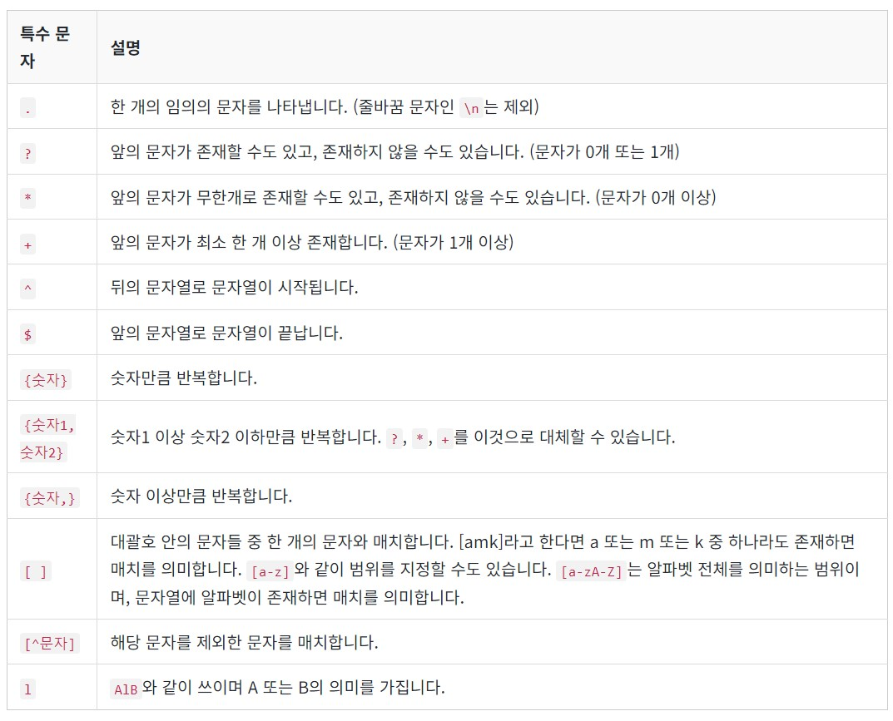
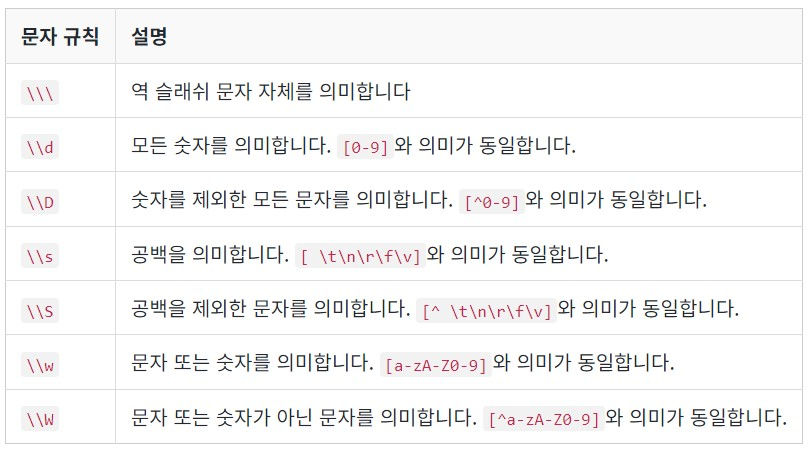
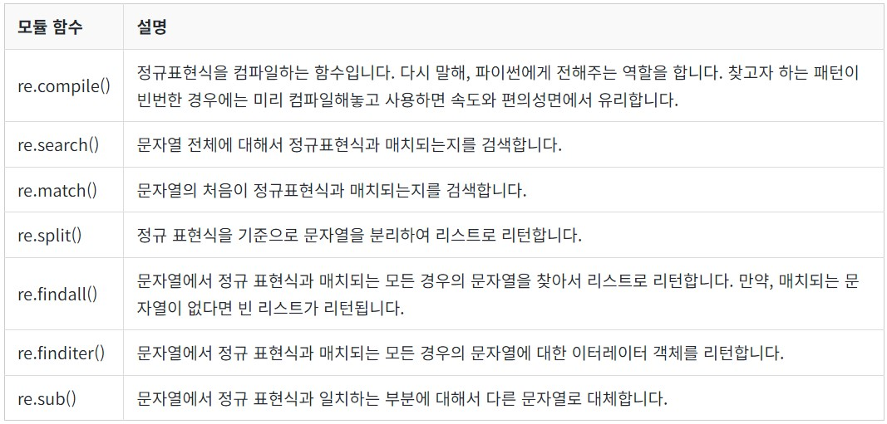

## NLP
- Natural Language(자연어) : 일상 생활에서 사용하는 언어
- Natural Language Processing(자연어 처리) : 자연어의 의미를 분석하여 컴퓨터가 처리할 수 있도록 하는 일(ex - 음성 인식, 내용 요약, 번역, 감정 분석, 텍스트 분류, 질의 응답, 챗봇)

## 사용 Tools
- Anaconda : Python과 관련된 여러 패키지(Numpy, Pandas, JupyterNB, IPython, Scikit-learn, matplotlib, seaborn, etc)를 모아놓은 파일

- Colab : Google에서 지원하는 Online IDE
Tensorflow는 기본적으로 64-bit platform만을 지원하고, DL에서는 GPU를 이용하는 경우가 많으므로, 개인 PC환경이 이를 지원하지 않을 경우 이용하는 것이 용이
[Google-Colab](https://colab.research.google.com/)

## 필요 프레임워크
1. Tensorflow
2. Keras
3. Gensim : ML을 사용하여 토픽 모델링과 자연어 처리 등을 수행할 수 있게 해주는 오픈소스 라이브러리
4. Scikit-learn
5. Jupyter NB
6. NLTK : 자연어 처리를 위한 python 패키지로, 기능활용을 위해 `nltk.download()` 명령어를 통해 NLTK Data를 설치해주어야 함
    - `treebank`라는 리소스가 설치되지 않아 오류가 발생할 경우 `nltk.download('treebank)`를 실행
7. KoNLPy : 한국어 자연어 처리를 위한 형태소 분석기 패키지
    - Windows에서 KoNLPy 설치 및 실행에 있어서 JDK, JPype 오류가 발생할 수 있음
        - JDK 1.7 이상 설치 후 경로 확인 및 환경 변수 설정
        - JPype : JAVA, Python 연결해주는 역할을 하며 설치된 Python의 버전과 Windows OS의 bit에 맞게 설치(ex - JPype1-0.6.3-cp36-cp36m-win_amd64.whl)
---
# Text Preprocessing(텍스트 전처리) : 문제의 용도에 맞게 텍스트를 사전에 처리하는 작업
1. Tokenization(토큰화) : 전처리되지 않은 상태의 Copus 데이터는 용도에 맞게 토큰화, 정제, 정규화 작업을 통해 처리된다.
    - Word Tokenization : 토큰의 기준을 단어(단어, 단어구, 의미를 갖는 문자열)로 설정
        - NLTK의 word_tokenize() : 띄어쓰기 단위로 구분
        - NLTK의 WordPunctTokenizer() : `.`, `,`, `!`등의 구두점을 제거, `'`는 보존
        - Keras의 text_to_word_sequence() : 모든 알파벳을 소문자로 바꾸면서 `.`, `,`, `!`등의 구두점을 제거, `'`는 보존
        - 단어 추출에서 단순히 띄어쓰기나 구두점의 제거는 원래 단어의 의미를 해칠 수 있음(줄임말, 자체로 띄어쓰기가 있는 경우 등)
        - `Penn Treebank Tokenization`
            1. 하이푼으로 구성된 단어는 하나로 유지한다.
            2. doesn't와 같이 아포스트로피로 '접어'가 함께하는 단어는 분리해준다.
    - Sentence Tokenization : 토큰의 단위가 문장일 경우
        - NLTK의 sent_tokenize()
        - 한국어 문장 토큰화 도구 KSS
            - 한국어와 같은 교착어(조사, 어미등을 붙여서 말을 만드는 언어)의 경우 형태소(morpheme)를 활용
    - Part-of-speech tagging(품사 태깅) : 단어 표기는 같으나 품사에 따라 의미가 달라지는 경우를 고려하여 tagging
        - NLTK의 pos_tag() : PRP는 인칭 대명사, VBP는 동사, RB는 부사, VBG는 현재부사, IN은 전치사, NNP는 고유 명사, NNS는 복수형 명사, CC는 접속사, DT는 관사
        - KoNLPy의 Okt, Mecab, Komoran, Kkma, Hannanum의 형태소 분석기
2. Cleaning(정제) : 갖고있는 corpus로부터 이상치(Noise Data)를 제거하여 토큰화 작업에 방해가 되는 부분을 배제
    - Stopword(불용어) 제거 : 큰 의미가 없는 단어(자주 등장하나 분석에 있어서 도움이 되지 않는 단어)를 제거
        - NLTK의 stopwords
        - 한국어의 경우 직접 불용어 사전을 생성해야 할 때가 많음
    - 등장 빈도가 적은 단어 제거 : 텍스트 데이터에 너무 적게 등장해서 자연어 처리에 도움이 되지 않는 단어들을 제거
    - 길이가 짧은 단어 제거 : 영어권에서 짧은 단어의 경우 대부분 자연어 처리에서 크게 의미가 없는 단어로 불용어에 해당하여 이를 제거(ex - a, I, it, at, on, in, by, etc)
    - 정규 표현식(Regular Expression) : 얻어낸 corpus에서 Noise Data의 특징을 잡을 수 있을 때 사용
        - 정규 표현식 문법 
        - Python 자체의 re모듈 
3. Normalization(정규화) : 표현 방법이 다른 단어들을 통합시켜서 같은 단어로 변환 - BoW(Bag of Words) 기반 자연어 처리에서 주로 사용
    - Lemmatization(표제어 추출) : 형태학(Morphology) 기반 어간(Stem), 접사(Affix)로 구성되는 형태소에 따라 parsing을 진행하여 표제어를 추출
        - NLTK의 WordNetLemmatizer : 단어의 형태가 보존하지만, 본래 단어의 품사 정보를 알아야 정확한 결과를 얻을 수 있음
    - Stemming(어간추출) : 정해진 규칙에 따라 단어의 어미를 제거하는 비교적 거친 분류 작업으로 결과값이 사전에 존재하지 않을 수 있음
        - NLTK의 PorterStemmer : Poter Algorithm을 기반으로 만들어진 어간 추출기
        - NLTK이 LancasterStemmer
    - 대, 소문자 통합
    